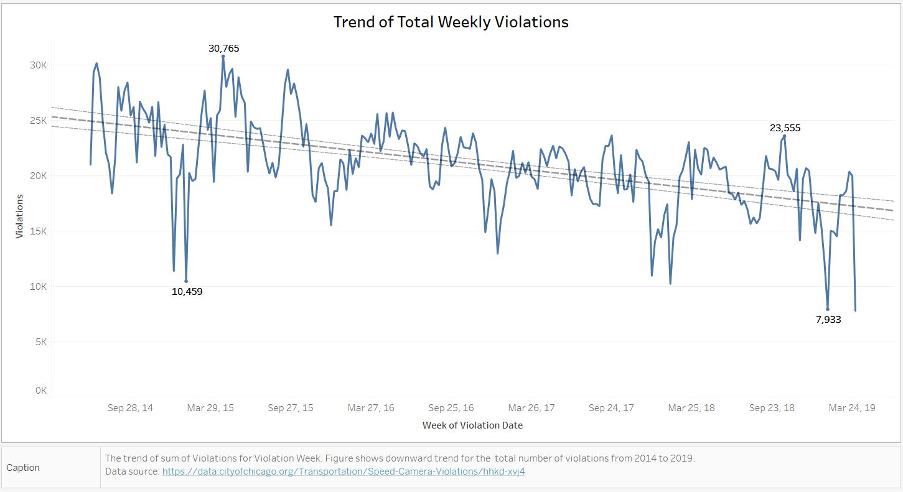
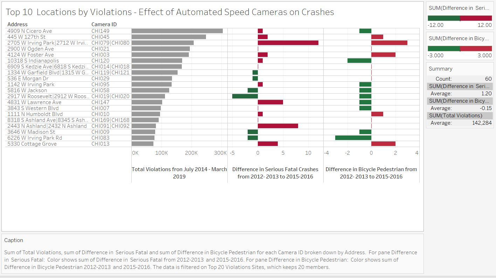

# Chicago Speed Camera Violations

## Background
Chicago experiences high number of crashes between vehicles and pedestrians, about 25% of which involve children. According to the City of Chicago [[Ref 1]](https://www.chicago.gov/city/en/depts/cdot/provdrs/automated_enforcement/news/2018/july/automated-speed-enforcement-cameras-to-be-activated-in-response-.html), “the Children’s Safety Zone Program protects children and other pedestrians by reminding motorists to slow down and obey speed laws – especially in school and park zones.” Safety zones are designated as a 660-foot boundary around any parks or schools. 
According to the City of Chicago [[Ref 1]](https://www.chicago.gov/city/en/depts/cdot/provdrs/automated_enforcement/news/2018/july/automated-speed-enforcement-cameras-to-be-activated-in-response-.html), “revenue collected from the program will be utilized for programs that enhance the safety of children, including afterschool, anti-violence and jobs programs; crossing guards and police officers around schools; and infrastructure improvements, such as signs, crosswalk markings and other traffic safety improvements.”

## Trendline and Forecast for Total Violations:
Figure shows that since the installation of automated speed cameras in parks and schools safety zones, total speed violations reported by all cameras are on decline. In general, this can be attributed to a couple of factors: 
1. First, drivers are now more aware of the camera locations and associated violation rules. This is also in accordance with the findings documented in annual report published by the City of Chicago [[Ref 2]](https://www.chicago.gov/content/dam/city/depts/cdot/Red%20Light%20Cameras/2017_Automated_Enforcement_Report20180427.pdf). It says, “In 2017, 90 percent of drivers that were issued a ticket for speeding in a school zone and 73 percent of drivers that were issued a ticket for speeding in a park zone did not receive a second ticket during the year, indicating they changed their behavior.” 
2. Second, policies related to speed camera violations have been changed over the years by the government after people complained about tickets they received, claiming violations were not legal.  For example, per [[Ref 3]](https://www.illinoispolicy.org/390000-drivers-set-to-receive-refunds-for-red-light-and-speed-camera-tickets/), around 390,000 drivers were set to receive refunds as a result of a lawsuit. In addition, removal of cameras at some locations, and change in policies regarding violation tickets to make the program more efficient, may also have contributed to decline in the number of tickets. 

Per Chicago Tribune [[Ref 4]](http://apps.chicagotribune.com/news/local/chicago-speed-camera-tickets/cameras/4909-n-cicero-ave/), “the 146 cameras placed around 61 parks and schools have generated more than $81 million in tickets through Sept. 1, 2015.” Although more recent data on revenue earned could not be found, but it is clear that revenue earned through the speed camera program is a significant source of income that the City has planned to use for the causes mentioned above [[Ref 1]](https://www.chicago.gov/city/en/depts/cdot/provdrs/automated_enforcement/news/2018/july/automated-speed-enforcement-cameras-to-be-activated-in-response-.html). The trendline and forecast curve also provides insights to the Mayor and his team that, with increased awareness and with improved efficiency with ticketing system, the revenue amount is supposed to decrease in future and the City should design its future policies regarding children’s safety program taking this trend into account.  

To Add ::    ------------------ Violations 4.43 per day 

#2 Improvement in Violation Policy - School Zone Violation in Summer Months

Online article [[Ref 5]](https://www.chicagotribune.com/news/watchdog/ct-speed-camera-bad-tickets-met-20151117-story.html) titled “Emanuel's Speed Cameras Issue $2.4 Million in Bad Tickets” describes loopholes in Chicago’s speed camera program. In this article, author descibes instances when tickets given to violators were not legal per City’s own rules. For the present analysis, I do not have access to all the data (e.g. time when ticket issued, park or school operating hours) needed to analyze these instances, but it is possible to analyze and focus on one of them, i.e. the violations that took place near school zones in summer months of June-August. Per article, “More than 62,000 school zone tickets were issued over the summer months when school activity is often so limited that drivers are left to guess whether school is in session or not. The law says tickets can be issued only on school days, typically defined as during the regular school year.”
Per speed camera guidelines provided in [Ref 1] and using the violations data, first it is confirmed that the speed cameras are installed either in Park Zones or in School Zones, identified by the City of Chicago. For the present analysis, to identify if a particular camera belongs to a School Zone or Park Zone, I used data available from [[Ref 5]](https://www.chicagotribune.com/news/watchdog/ct-speed-camera-bad-tickets-met-20151117-story.html). The raw data is in PDF format and was converted to CSV data. The data provides for each camera ID the nearby school or park name along with its address. The “name” strings that contains word “Park” were tagged as Park Zone cameras and the rest were tagged as “School”. A “Park-School” column was then added to the original violations data based on the camera ID.      
Initial data exploration shows that Park Zone cameras are operating on all days (Monday-Friday) of a week, whereas School Zone cameras operate only on weekdays (Monday-Friday). No violations on Saturdays and Sundays were recorded by School Zone cameras. This information is also validated using the speed camera guidelines provided in [Ref 1]. Apart from Saturdays and Sundays, it is also observed from data exploration that school cameras are not operating on public holidays (e.g. July 4, December 25, January 1, etc.). This is not the case with park cameras as they also operate on holidays.
In general schools in Chicago observe Summer break - Around 10–11 weeks, either from the end of May to mid-August, early June to late August, or the end of June to the day after Labor Day in early September. 
Plots show that number of School Zone violations/traps are significantly low during the month of August. However, this is not the case for school zones in the month of July when also schools remain closed. There is in accordance with the summer month instances reported in the article. 
With this visual, we want to send a message to Mayor Rahm Emanuel that action should be taken to correct this illegal violation distribution during summer months. This will also decrease burden on ticket processing centers and on the courts hearing these appeals. Drivers in School Zones are also confused whether the cameras are operating or not and as a results average number of tickets in the month of July in School Zones are significantly high. People tend to assume that school cameras are not operating when schools are off.   

##

## References

* Ref 1: The City of Chicago: https://www.chicago.gov/city/en/depts/cdot/provdrs/automated_enforcement/news/2018/july/automated-speed-enforcement-cameras-to-be-activated-in-response-.html
* Ref 2: The City of Chicago: https://www.chicago.gov/content/dam/city/depts/cdot/Red%20Light%20Cameras/2017_Automated_Enforcement_Report20180427.pdf
* Ref 3: Illinois Policy: https://www.illinoispolicy.org/390000-drivers-set-to-receive-refunds-for-red-light-and-speed-camera-tickets/
* Ref 4: Chicago Tribune:  http://apps.chicagotribune.com/news/local/chicago-speed-camera-tickets/cameras/4909-n-cicero-ave/
* Ref 5: https://www.chicagotribune.com/news/watchdog/ct-speed-camera-bad-tickets-met-20151117-story.html
