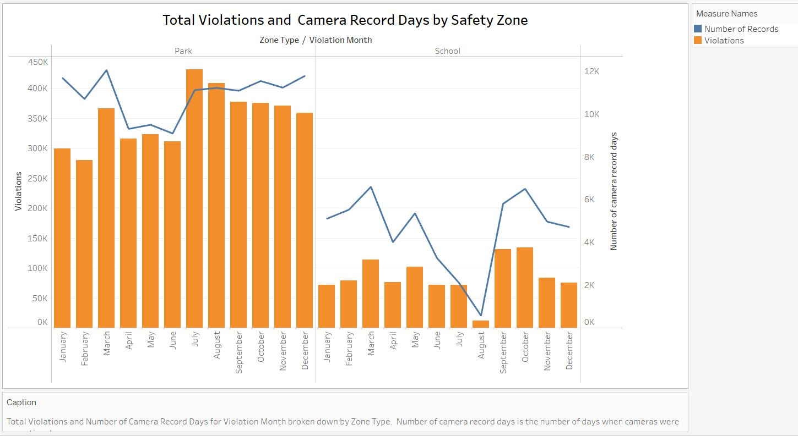
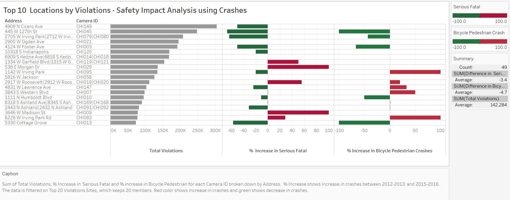

# Chicago Speed Camera Violations
## Background
Chicago experiences a high number of crashes between vehicles and pedestrians, about 25% of which involve children. Automated Speed Camera Program is a part of Children’s Safety Zone Program. According to the City of Chicago [[Ref 1]](https://www.chicago.gov/city/en/depts/cdot/provdrs/automated_enforcement/news/2018/july/automated-speed-enforcement-cameras-to-be-activated-in-response-.html), “the Children’s Safety Zone Program protects children and other pedestrians by reminding motorists to slow down and obey speed laws – especially in school and park zones.” Safety zones are designated as a 660-foot boundary around any parks or schools. Per the City of Chicago [[Ref 1]](https://www.chicago.gov/city/en/depts/cdot/provdrs/automated_enforcement/news/2018/july/automated-speed-enforcement-cameras-to-be-activated-in-response-.html), “revenue collected from the program will be utilized for programs that enhance the safety of children, including afterschool, anti-violence and jobs programs; crossing guards and police officers around schools; and infrastructure improvements, such as signs, crosswalk markings and other traffic safety improvements.”

## Data Sources
**Speed Camera Violations:** Contains speed violations recored by automated speed cameras installed by the City at Safety Zones. Data used in the present analysis is obtained from the City of Chicago Data Portal [[link]](https://data.cityofchicago.org/Transportation/Speed-Camera-Violations/hhkd-xvj4).  
**Safety Zone Data:** Contains name and address of a school or park near which a camera is installed. Safety Zone is defined as the area within the 1/8th mile radius of a school or park. Data used in the present analysis is obtained from the link [[here]](https://www.chicago.gov/content/dam/city/depts/cdot/Red%20Light%20Cameras/2017_Automated_Enforcement_Report20180427.pdf).  
**Vehicle Crash Data:** Contains crash statistics (e.g. fatal crashes, pedestrian bicycle crashes, etc.) for city-wide locations and for the locations in Safety Zones where speed cameras are installed. Crash data are available for years 2012-2013, years before Safety Zone cameras were installed, and for 2015-2016, years after Safety Zone camera were installed. Data used in the present analysis are obtained from the link [[here]](https://www.chicago.gov/content/dam/city/depts/cdot/CSZ/ASE_CrashAnalysisWriteUp_10_10_18.pdf). 

## Data Description  

A brief description of the variables used in the present analysis is as follows: 
**Operational Camera Day:** Each record (or row) in Speed Camera Violations data is for a certain day when a camera is operational.   It is possible that a camera is not opertational on some days, e.g. school cameras are not operational on weekends.  
**Violations:** Each record (or row) in the Speed Camera Violations dataset has the number of violations captured by a camera on a particular Operational Camera Day. A camera on a given Operational Camera Day may have multiple violations. 
**Violation Date:** Date corresponding to an Operational Camera Day for which violations are provided. Note that exact time of violation is not provided in the data.  
**Camera Location:** Camera location is the location where camera is located; it is specified in terms of Latitude/Longitudes or in State Plane Coordinate System.  
**Safety Zone:** Safety zone is defined as the area in the 1/8th mile radius of a school or park. There are only two possible types of Safety Zones: School Zone and Park Zone.  
**Address:** Address of the location of the speed enforcement camera(s). There may be more than one camera at each address. It is confirmed that the Latitude-Longitude coordinates are identical to X-Y coordinates in State Plane System.   
**Camera ID:** A unique ID associated with the physical camera at each location. There may be more than one camera at a physical address.

## Trendline for Total Violations
**Analysis and Insights:**
To understand the trend of total violations in the Safety Zones around Chicago, the Speed Camera Violations data mentioned above was used. Figure 1 below shows that since the installation of automated speed cameras in Safety Zones, total speed violations recorded by all cameras are on the decline. Based on the results in Figure 1, it is observed that the total violations are decreasing at an average rate of 4.43 violations per day. Based on the information available from sources, this decline can be attributed to two major factors: 
1. Drivers are now more aware of the camera locations and associated violation rules. This is also in accordance with the findings documented in the annual report published by the City of Chicago [[Ref 2]](https://www.chicago.gov/content/dam/city/depts/cdot/Red%20Light%20Cameras/2017_Automated_Enforcement_Report20180427.pdf). It says, “In 2017, 90 percent of drivers that were issued a ticket for speeding in a school zone and 73 percent of drivers that were issued a ticket for speeding in a park zone did not receive a second ticket during the year, indicating they changed their behavior.” 
2. Policies related to speed camera violations have been changed over the years by the government after people complained about tickets they received, claiming violations were not legal. For example, per [[Ref 3]](https://www.illinoispolicy.org/390000-drivers-set-to-receive-refunds-for-red-light-and-speed-camera-tickets/), around 390,000 drivers were set to receive refunds as a result of a lawsuit. Further, removal of cameras at some locations, and change in policies regarding violation tickets to make the program more efficient may also have contributed to the declining number of violations. 

  <b>Figure 1: Trend of Total Weekly Violations</b>

Tableau Public Link: https://public.tableau.com/profile/pragyan.sharma#!/vizhome/SppedCameraViolations_CityofChicago_Report/Dashboard

With regards to revenue generated by the Speed Camera Violations program, Figure 1 also provides insights for the Mayor and his team. Per Chicago Tribune [[Ref 4]](http://apps.chicagotribune.com/news/local/chicago-speed-camera-tickets/cameras/4909-n-cicero-ave/), “the 146 cameras placed around 61 parks and schools have generated more than $81 million in tickets through Sept. 1, 2015.” Although more recent data on revenue earned could not be found, but it is obvious that the revenue earned through the Speed Camera Program is a significant source of income that the City has planned to use for the causes mentioned above [[Ref 1]](https://www.chicago.gov/city/en/depts/cdot/provdrs/automated_enforcement/news/2018/july/automated-speed-enforcement-cameras-to-be-activated-in-response-.html). With increased awareness among people and with improved efficiency in the system since the program started, the revenue amount is supposed to decrease in future, and the City should design its future policies regarding children’s safety program taking this revenue decline into account. 

**Basis for Chart Selection**
* Final vesrion of the chart is shown in Figure 1. 
* Line charts are often the preferred chart type for showing trends in the data, and blue color is the standard chart color. During the data-exploration phase of this project, red-blue colormap for this chart was used; however, it is now realized that colors are actually not required and may distract the reader. Single color is eventually utilized for the final version. 
* Weekly chart for the violations data gives a clearer picture without losing granularity of the data. Although similar trend can be observed in annual, monthly or daily charts but weekly chart appears to be more readable, less distracting, and less cluttered. Daily chart is found noisy and contains more information than actually needed to convey the message of declining violation trend.   
* Labeling a few high and low points increases readabilty and relatabilty. 
*  It is observed that adding operations like running mean, cummulative sum, etc. to the data doesn't really add any useful insights so are not applied to the data. 
* Keeping the audience in mind, the confidence interval lines in the first version of this chart are now removed. 
* Sum of violations was preferred over average violations because it is better associated with the total revenue generated.  

**Message to the Mayor:**
1. Number of violations are on the decline. Trendline shows violations are decreasing at an average rate of 4.43 violations per day.
2. Future revenue will go down, and the city of chicago should consider this for future policy making. 
3. Efforts made by the government for making the system more efficient have worked, which is necessary for the success of this project. 

## School Zone Violations in Summer Months

Online article [[Ref 5]](https://www.chicagotribune.com/news/watchdog/ct-speed-camera-bad-tickets-met-20151117-story.html) titled “Emanuel's Speed Cameras Issue $2.4 Million in Bad Tickets” describes loopholes in Chicago’s Speed Camera Program. In this article, author describes instances when tickets given to violators were not legal per City’s own rules. For the present analysis, all data  needed to analyze these instances (e.g. exact time when ticket was issued, park or school operating hours) are not available, but it is possible to analyze one of them, which is the violations that took place near School Zones in summer months of June-August. Per the article, “More than 62,000 school zone tickets were issued over the summer months when school activity is often so limited that drivers are left to guess whether the school is in session or not. The law says tickets can be issued only on school days, typically defined as during the regular school year.”

Per speed camera guidelines provided in [[Ref 1]](https://www.chicago.gov/city/en/depts/cdot/provdrs/automated_enforcement/news/2018/july/automated-speed-enforcement-cameras-to-be-activated-in-response-.html) and the violations data, first, it is confirmed that the speed cameras are installed either in Park Zones or in School Zones, identified by the City of Chicago. To identify if a particular camera belongs to a School Zone or Park Zone, "Safety Zone Data" described above is used (The raw data is in PDF format and was converted to CSV data.) The data provides for each camera ID the nearby school or park name along with its address. The “name” strings that contain the word “Park” were tagged as Park Zone cameras and the rest were tagged as School Zone cameras. A “Park-School” column was then added to the original violations data based on the camera ID. Table 1 below shows number of cameras, total number of days when cameras were active and the total number of violations reported for both Park and School Zones. Violations reported by Park Zone cameras is approximately 4 times higher than by School Zone cameras. Operational Camera Days are also much higher for Park Zone cameras.    

**Table 1: Statistics for Park and School Zone Cameras**  

**Zone Type**| **Cameras**| **Operational Camera days** | **Violations**
-------------------- | :----------:  | :----------:  | :----------: 
Park |84 | 130,283 | 4,217,248
School|78 | 54,527 | 1,021,624

Initial data exploration shows that Park Zone cameras are operating on all seven days of a week, whereas School Zone cameras operate only on weekdays (Monday-Friday). No violations on Saturdays and Sundays were recorded by School Zone cameras. This information is also validated using the speed camera guidelines provided in [[Ref 1]](https://www.chicago.gov/city/en/depts/cdot/provdrs/automated_enforcement/news/2018/july/automated-speed-enforcement-cameras-to-be-activated-in-response-.html). Moreover, apart from weekends, it is also found from data exploration that School Zone cameras do not operte on public holidays (e.g. July 4, December 25, January 1, etc.). Figure 2 below shows box-plot diagrams for average speed violations in Park and School Zones. Outlier days recording relatively high number of violations can be clearly seen on box-plot diagrams. Park Zones camera record significantly high number of violations on public holidays (e.g. July 4, December 25, January 1, etc.) but School Zone cameras do not operate on these holidays. It is also observed that School Zone cameras have high violations recorded on Labor Day (September 2 or 3) which is probably an anomaly in the Speed Camera System because, per government regulations, School Zone cameras should not be operational on holidays. 

  <b>Figure 2: Average Violations (per camera per day) in School and Park zones</b>

For previous data exploration assignment, Figure 3 below was used to show a comparison between the "Operational Camera Days" and "Number of Total Violations" for both zones combined. Number of Operational Camera Days provides a measure of when cameras were active or used as traps by the City. For example, as shown in Figure 3 for the month of August, the City puts less number of camera traps in comparison to that in other months.  

  <b>Figure 3: Total Violations and Operational Camera Days by Year</b>

This finding gave an idea that it is probably due to the School Zone policy of the City that cameras there did not record violations or were not operational when schools were closed. In general, schools have summer break during the period Mid June - End of August. Therefore, for further analysis, data was partitioned into two categories, Parks and Schools. Figure 4 clearly confirms that the low number of Operational Camera Days in the month of August for schools is a reflection of City's regulations regarding School Zone cameras. In Park Zone cameras, however, this features is not observed. More importantly, for school zone cameras, it can be noticed that significatly higher number of cameras were operational in July than in August. This was likely an error in the system because one would expect same number of operational cameras in both August and July (summer months) in school zones. This error was probably the reason for illegal tickets distributed to the violators in the summer months in school zones as discussed above. 

  <b>Figure 4: Total Violations and Operational Camera Days by Safety Zone</b>

Link for Tableau: https://public.tableau.com/profile/pragyan.sharma#!/vizhome/SppedCameraViolations_CityofChicago_Report/Dashboard

With the visual in Figure 4, we want to send a message to Mayor Rahm Emanuel that action should be taken to correct this illegal ticket distribution during summer months. This will also help in decreasing the burden on ticket processing centers and on the courts hearing the ticket appeals. Drivers in School Zones are also confused whether the cameras are operating or not and as a results average number of tickets in the month of July in School Zones are significantly high. People tend to assume that school cameras are not operating when schools are off. 

**Basis for Chart Selection**
* The color in the final-version chart is changed from Brown to Blue. This is done to make color scheme consistent for all visuals. Blue color is used everywhere for total number of violations in final-version visuals. 
* Dual-axis chart is preferred here. It helps in clearly showing the monthly variation of both Total Violations and Operational Camera Days using just one plot. Left axis shows total number of violations and the right axis shows the number of days all cameras were operational. 
* Figure shows both School and Park Zone data. Zones were stacked horizontally for direct comparison.
* Colors for violations for both Park and School categories are kept same for consistency. Choosing different colors does not really provide any benefit. It actually increases clutter due to extra legend item.
* Interactive filter is added so that the end-user can either look at one catagory (school or Park) or all catagories at a time.   
* A filter for school and park has been added to make it easier for the end user to view if they are focused on one zone type. Although the main idea was abouyt having filter gave
* The varalbe name "Number of Records" is changed to "Operational Camera days" for more clarity. "Operational Camera days" variable is clearly defined in the "Data Description" section above.   

**Message to Mayor**
1. 
2. 
3. 

## Safety Impact Analysis – Before and After Crashes

The City of Chicago conducted “Safety Impact Analysis of Speed Cameras Program” in 2018 to estimate the efficacy of the speed camera program. Per report generated by the City of Chicago [[Ref 6]](https://www.chicago.gov/content/dam/city/depts/cdot/CSZ/ASE_CrashAnalysisWriteUp_10_10_18.pdf), two major findings of the analysis are as follows:
* Fatal or serious injury crashes decreased 9% near speed cameras, compared to 6% increase citywide.
* Overall crashes have increased 1% in the automated speed enforcement locations compared to a 21% increase in crashes citywide from 2012-13 to 2014-16 period.

These findings create a positive sentiment regarding the speed camera program that it has worked and is contributing towards reducing the number of crashes near the speed camera locations. However, I noticed that these findings were based on crash incidents from all speed camera locations, and they may not provide a true picture for the cameras that are reporting significantly high number of violations. To analyze this, I downloaded and processed the 2-year crash data (2015-2016) given in [Ref 6]. Crash data includes, for each Camera ID, number of crashes in categories “Total Crashes”, “Serious Fatal”, “Bicycle Pedestrian”, “Speed Related”, and “Youth Related” for all speed camera locations. Processing of data was done in Python, and I have attached the python [script](Crash_Violation_Data_Merge_Code.ipynb)  with the GitHub project. 

Since the City of Chicago has reported findings for “Serious Fatal” and “Bicycle Pedestrian” type instances only, we have focused on these two categories for the present analysis. Figure 4 shows the change in the number of “Serious Fatal” and “Bicycle Pedestrian” type crashes for the top 20 speed camera violation locations. Results show a mixed picture. There may be an overall decrease in crashes for top 20 locations, but some of these locations are not showing any improvement in terms of reduction in crashes. Therefore, it is important for the City of Chicago to further investigate the camera locations that are recording a significantly high number of violations but, in fact, cameras there are not solving the actual purpose for which they have been installed.

  <b>Figure 4: Top 10 Locations by Violations - Safety Impact Analysis using Crash Data</b>

Link for Tableau: https://public.tableau.com/profile/pragyan.sharma#!/vizhome/ChicagoSpeedCameraViolationsandCrashes/ViolationsandCrashes
  
  
**Basis for Chart Selection**
After experimenting with different chart types, I have decided to use “bar” charts as they provide a clear picture in this case without creating distractions. Line plots in this case create clutter and are difficult to apprehend for this type of data.

## Dashboards
I have used data from multiple sources and the granularity for both the datasets is different, so it was convenient for me to create two separate dashboards, otherwise I might have lost data in merging or joining in tableau.

Dashboard 1: SpeedCameraViolations_CityofChicago 
https://public.tableau.com/profile/pragyan.sharma#!/vizhome/SppedCameraViolations_CityofChicago_Report/Dashboard

Dashboard 2: ChicagoSpeedCameraViolationsandCrashes
https://public.tableau.com/profile/pragyan.sharma#!/vizhome/ChicagoSpeedCameraViolationsandCrashes/ViolationsandCrashes

## Summary and Conclusions
1. Three final visuals are shown in Figure 1, Figure 3 and Figure 4.
2. Trendline visual shows decline in total number of violations. This will also lead to revenue loss for the City in future, and therefore City should account for the loss in future policy making. 
3. There are some loopholes in the way cameras in School Zones operate in summer months. It is clear from the analysis that, in comparison to August, lot more cameras are operational in July while schools are closed in both July and August.  
4. Safety impact analysis using crash data shows that some cameras that report significantly high number of violations have not actually contributed towards reducing number of "Serious Fatal" and "Bicycle Pedestrian "  type crashes.  The City should investigate further to make these cameras more effective. 

## References

* Ref 1: The City of Chicago: https://www.chicago.gov/city/en/depts/cdot/provdrs/automated_enforcement/news/2018/july/automated-speed-enforcement-cameras-to-be-activated-in-response-.html
* Ref 2: The City of Chicago: https://www.chicago.gov/content/dam/city/depts/cdot/Red%20Light%20Cameras/2017_Automated_Enforcement_Report20180427.pdf
* Ref 3: Illinois Policy: https://www.illinoispolicy.org/390000-drivers-set-to-receive-refunds-for-red-light-and-speed-camera-tickets/
* Ref 4: Chicago Tribune:  http://apps.chicagotribune.com/news/local/chicago-speed-camera-tickets/cameras/4909-n-cicero-ave/
* Ref 5: https://www.chicagotribune.com/news/watchdog/ct-speed-camera-bad-tickets-met-20151117-story.html
* Ref 6: https://www.chicago.gov/content/dam/city/depts/cdot/CSZ/ASE_CrashAnalysisWriteUp_10_10_18.pdf
